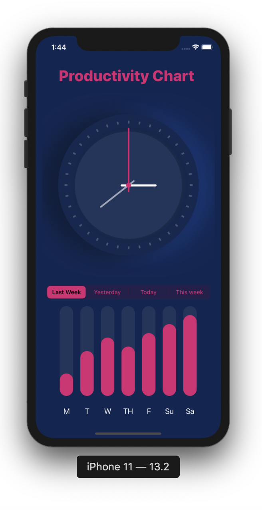
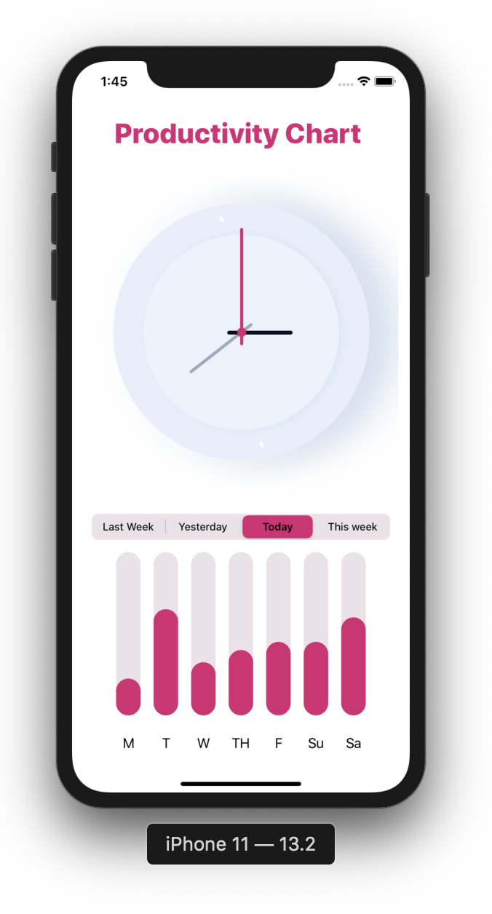

# Productivity-Chart
Использование `SwiftUI` на примере графика продуктивности 
## Описание
Приложение с 4-мя сегмент контролерами с отображение продуктивности.

Создал приложения с целью поработь с `SwiftUI` и с изменением Appearance на `Light` или `Dark`. При той или иной темы
отобразил разные цвета текса и фона, а также изменение картинки.

 

